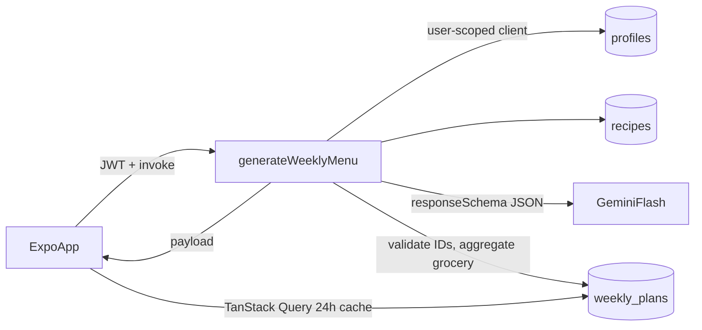

# Low-Friction Nutrition App - Build Plan

Target: `C:\my-diet-app`. One repo holding both the Expo app and the `supabase/` folder.
Platform: **Android only** for now (no iOS config, local builds via Android Studio SDK, no EAS required).

## Build steps (confirm between each)

- [x] 1. Environment check, init Expo TS app, install dependencies
- [x] 2. Supabase migration (spec DDL + weight_logs, cheat_logs, is_active, sex/activity) with RLS
- [x] 3. `seed.sql` with 10 quick bilingual recipes and categorized ingredients/swaps
  - Recipes now live in `supabase/recipes/*.json`. `npm run recipes:seed` validates them and rewrites `supabase/seed.sql`. Each dish has `cuisines`; the profile stores `preferred_cuisines` (language picks the first choice). The planner prefers a matching kitchen and still fills a slot from any valid recipe.
- [x] 4. `generate-weekly-menu` Edge Function (Gemini responseSchema, ID validation, deterministic grocery aggregation, calorie check, upsert)
- [x] 5. Configure NativeWind v4, expo-router, `app.json` (RTL, Android AdMob), `.env.example`
- [x] 6. Core: services (supabase, menuApi hooks), i18n + locales he/en, Zustand grocery store, root layout providers
  - RTL reload uses `reloadAppAsync()` from `expo` (works in dev and release), so `expo-updates` was dropped.
- [x] 7. Screens: auth (login, onboarding w/ TDEE), tabs (dashboard, grocery, bank, profile), recipe detail, components
  - Routing: `login.tsx` and `onboarding.tsx` sit at the app root (not an `(auth)` group); the root `Stack` uses `Stack.Protected` guards: signed out -> login, no profile -> onboarding, otherwise tabs, `recipe/[id]` and `settings`.
  - `settings.tsx` reuses the onboarding form; targets are recalculated on save and apply to the next generated week.
  - Login uses a 6-digit email code: `supabase/templates/otp_code.html` (he/en) is wired in `config.toml`; hosted projects need the same template in the dashboard.
  - Ads: interstitial while generating, banner on dashboard/grocery, non-personalized requests, no-op in Expo Go. The rewarded "extra swap" is deferred (the backend has no meal-swap yet).
  - Calorie maths in `lib/tdee.ts` and form validation in `lib/profileForm.ts` are covered by `npm run test:app`.
  - Onboarding is a 5-step wizard (about you, activity, routine, kashrut, summary) with per-step validation and Back/Next; Settings shows all sections on one page.
- [x] 8. Verify: typecheck, test grocery aggregation, README setup steps
  - Lint (`eslint-config-expo`), typecheck, 33 tests, `expo-doctor` 21/21 and the Android bundle all pass. `expo-font` added (required by `@expo/vector-icons` outside Expo Go).
  - `README.md`: setup, running, commands, Gemini models, dev build, going-live checklist, known limitations.
- [x] 9. Design pass (after step 8): logo/app icon/splash, palette + Hebrew-friendly font, recipe photos, native date/time pickers, empty/loading states, nicer weight chart
  - Style A "Fresh & friendly" chosen from three mockups. Colours in `tailwind.config.js` + `src/lib/theme.ts`.
  - Rubik via `@expo-google-fonts/rubik`; `src/components/Text.tsx` maps weight classes to font files (Android ignores `fontWeight` for custom fonts). Splash stays up until fonts load.
  - Dashboard: greeting, calorie ring (`react-native-svg`), treat pill, date-circle day strip, meal cards with round photos.
  - AI-generated icon/splash (`#C6F1D8` background) and 10 recipe photos (`assets/recipes/<id>.jpg`, 512 px). App name "NutriMind".
  - Native Android date/time pickers (`@react-native-community/datetimepicker`), helpers in `src/lib/dateInput.ts` (tested).
  - Weight line chart with 7-entry average and dashed target line; `EmptyState` for empty lists.

## Next version

- Connect the app to a supermarket service so the weekly ingredients list can
  automatically create a shopping cart ready for the user to review and buy.

### Personalized calorie targets (brainstorm — not started)

Today: Mifflin–St Jeor BMR × activity → maintenance (TDEE), then a fixed deficit
(500 kcal if ≥5 kg to lose, 350 if <5 kg, 0 if at goal), minus coffee with
milk/sugar. Saved on `profiles.daily_calorie_target` / `weekly_cheat_bank` via
`src/lib/tdee.ts` + `buildProfileInput`. Gemini does **not** compute the target;
it only picks recipes near slot budgets.

Goal: feel more like a coach, still clearly “estimate, not medical advice.”

#### Priority ideas

1. **Pace / deficit choice** — slow / normal / aggressive (e.g. 250 / 350 / 500),
   or “kg per month” → derive deficit. Keep safe floors (1200F / 1500M).
2. **Suggested + editable target** — show the calculated number; let the user
   override (dietitian / doctor / preference). Clamp to safe bounds.
3. **Auto-adjust from weight trend** — after 2–3 weeks of weigh-ins (+ optional
   meal check-ins): if weight is flat, nudge food target down a little; if losing
   too fast, raise it. Highest “true personalization” without labs.
4. **Free-text lifestyle / food notes** — optional box: night shifts, vegetarian,
   “I walk a lot,” hated foods. Use for **meal planning constraints** (rules +
   Gemini context), not as a silent medical calorie recalculation from prose.
5. **Blood tests / labs (later, careful)** — high liability and privacy cost.
   Prefer structured flags (“thyroid issue — talk to doctor”) or
   “my doctor set my calories” override. If free-text/PDF ever exists: use only
   for meal hints (e.g. low sodium), strong disclaimer, sensitive-data handling
   in privacy policy + Play Data safety. Do **not** invent BMR from lab paste.

#### Out of scope / avoid for v2 unless reviewed

- Claiming clinical accuracy or diagnosing from labs
- Sending full PHI (labs, conditions) to Gemini without explicit consent + minimization
- Removing the formula entirely in favor of unconstrained AI calorie numbers

#### Implementation sketch (when we pick this up)

- UI: onboarding/settings — pace picker + optional override + optional notes field
- Schema: e.g. `deficit_pace`, `calorie_target_override`, `planning_notes` (text)
- Logic: extend `calorieTargets` / weekly adjust job from `weight_logs`
- Planner: pass notes/constraints into edge function context; keep portion math in code
- Copy: “Estimate only — not medical advice” in onboarding and target summary

## Environment

- Node must be **20+** (latest Expo SDK). Machine currently has v18.12.0.
- Android SDK: `C:\Users\friedy2\AppData\Local\Android\Sdk` (present). Set `ANDROID_HOME` to it.
- JDK: use Android Studio's bundled JBR: `C:\Program Files\Android\Android Studio\jbr`. Set `JAVA_HOME` to it.
- AI model: Gemini 1.5 Flash is retired. Model name read from `GEMINI_MODEL` env, default `gemini-flash-latest` (alias; `gemini-2.5-flash` is closed to new users), via `npm:@google/genai` in Deno. Use the paid tier before launch (health data in prompts).
- AdMob (`react-native-google-mobile-ads`) does not run in Expo Go. Develop in Expo Go first (ads wrapped as no-op), then use a local dev build: `npx expo run:android`.

## Spec gaps filled

- `weight_logs` table (listed but missing from DDL): `user_id`, `logged_on`, `weight_kg`, unique per user/date.
- `recipes.is_active boolean default true` (function queries "active" recipes).
- `profiles.sex`, `profiles.activity_level`, `profiles.skips_breakfast boolean default true` (needed for TDEE).
- `cheat_logs` for the Bank tab: `user_id`, `logged_at`, `kind` ('sweet'|'beer'|'other'), `calories`, `note`.
- RLS: explicit `with check` on write policies; recipes readable by authenticated users.
- Grocery aggregation done **deterministically in the Edge Function** from DB ingredients x portion multiplier. Gemini only returns the schedule (day, slot, `recipe_id`, `portion_multiplier`, type). Daily calorie totals are verified in code, not trusted from the model.

## Kosher support (added)

- `profiles.kosher_level`: `none` | `kosher` | `mehadrin`. Asked in onboarding, editable in Profile settings.
- `profiles.meat_dairy_wait_hours`: 6 (default) | 3 | 1, shown only when kosher.
- `recipes.kashrut_type`: `meat` | `dairy` | `parve`; `recipes.is_kosher` (kosher ingredients, no mixing). Swaps keep the recipe's kashrut type.
- Ingredient `insect_check: true` on leafy greens, herbs, broccoli, legumes -> grocery hint (check or buy certified insect-free brands).
- Edge Function rules for kosher users:
  - Only `is_kosher` recipes are offered to the model (enforced in code, not trusted to the model).
  - No dairy meal within `meat_dairy_wait_hours` after a meat meal on the same day; validated in code using nominal slot times (breakfast 08:00, lunch 13:00, snack 16:30, dinner 19:30). On violation, the later meal is swapped for a parve/meat alternative.
  - Office-day takeaway guidance: order only from kosher-certified (or mehadrin) restaurants on Cibus/10bis.
- Grocery list for `mehadrin`: hint to buy products with mehadrin certification (e.g. Badatz) and chalav Yisrael dairy.
- Meal times are per user (`profiles.breakfast_time`, `lunch_time`, `snack_time`, `dinner_time`), editable in settings; the wait rule uses them.
- Shabbat (kosher users): Friday dinner and all Saturday meals use `recipes.shabbat_friendly` recipes (prepared before Shabbat, served cold or at room temperature) and are flagged `prepare_before_shabbat` in the plan so the app can show a "prepare on Friday" badge. Saturday is never a takeaway day.
- Office-day takeaway is treated as meat for the wait rule (conservative).

## Generator implementation notes (step 4)

- The model returns only `{day, slot, recipe_id}`; portions are computed in code to hit the daily food target (within ~5%).
- `chooseRecipes` (`_shared/planRules.ts`) is the single gatekeeper: kashrut/Shabbat rules are never relaxed; max 3 uses per recipe per week and no repeat within a day are relaxed only when nothing else fits. If a meat meal makes a later slot impossible, the day is re-planned with meat banned in that slot.
- Models are tried in order: `GEMINI_MODEL` (default `gemini-3.8-flash`), then `GEMINI_FALLBACK_MODELS` (default `gemini-3.7-flash,gemini-3.5-flash,gemini-flash-latest`), one attempt each, within a 40s total budget. `plan.model` records the model that answered. Free-tier keys allow 20 requests/day per model, so backups matter in development.
- If every model fails or `GEMINI_API_KEY` is unset, the same rules build a deterministic plan (`source: 'fallback'`).
- Only calorie targets, slot times and the recipe catalog are sent to Gemini (no age, weight or other profile data).
- Request body `{ week_start_date? }` must be the current or next Sunday (Asia/Jerusalem). Response: `{ plan_id, plan: WeeklyPlanPayload }`. Errors: 401 `UNAUTHORIZED`, 400 `INVALID_WEEK`, 409 `PROFILE_REQUIRED`, 503 `NO_RECIPES`, 500 `INTERNAL`.
- Tests: `npm run test:functions` (Node's built-in runner; Deno not required). Typecheck: `npm run typecheck`.

## Architecture

## Supabase backend (`supabase/`)

- `supabase/config.toml` via `npx supabase init`.
- `supabase/migrations/20261004000001_init.sql`: DDL + gap fixes, indexes (`weekly_plans(user_id, week_start_date)` unique, `weight_logs(user_id, logged_on)`), RLS policies. Profile is created in onboarding.
- `supabase/seed.sql`: 10 quick recipes (<=20 min, 350-650 kcal, lunch/dinner/snack, Israeli-supermarket ingredients) with `ingredients` JSONB `{name_he, name_en, amount, unit, category, swaps[]}`. Categories: `produce, dairy, meat_fish, bakery, pantry, frozen, beverages`.
- `supabase/functions/generate-weekly-menu/index.ts`:
  1. CORS + require `Authorization`; `supabase.auth.getUser()` to verify JWT.
  2. Load profile; compute daily target (minus cheat bank spread across week).
  3. Load active recipes metadata (`id, title_en, calories, protein_g, prep_time_minutes, meal_types`).
  4. System prompt (deficit rules, skip breakfast, office days = `takeaway` with Cibus/10bis guidance, max 2 repeats/week) + user context JSON.
  5. Gemini call with `responseMimeType: "application/json"` + `responseSchema` using `enum` of valid recipe IDs.
  6. Validate: replace unknown IDs, clamp multipliers 0.5-2, adjust portions to hit daily target, one retry on parse failure.
  7. Aggregate grocery list by category + ingredient + unit.
  8. Upsert `weekly_plans` on `(user_id, week_start_date)`; return payload.
- `supabase/functions/_shared/`: `cors.ts`, `types.ts`, `grocery.ts` (pure, `deno test`-able).
- Secrets: `GEMINI_API_KEY`, `GEMINI_MODEL` via `supabase secrets set`.

## Mobile app (`C:\my-diet-app\src`)

App code lives under `src/` (Expo default): `src/app/` for routes, and `src/components`, `src/services`, `src/store`, `src/lib`, `src/locales`, `src/types` beside it. Paths below are relative to `src/`. Config files (`app.json`, `tailwind.config.js`, `babel.config.js`, `metro.config.js`, `global.css`) stay at the repo root.

- Init: `npx create-expo-app@latest . --template blank-typescript`, then add `expo-router`, `nativewind` + `tailwindcss`, `@supabase/supabase-js`, `@react-native-async-storage/async-storage`, `@tanstack/react-query` + persister, `zustand`, `i18n-js`, `expo-localization`, `react-native-google-mobile-ads`, `expo-dev-client`.
- `app/_layout.tsx` - QueryClient (24h staleTime/gcTime, AsyncStorage persister), AuthProvider, i18n init, auth redirect.
- `app/(auth)/login.tsx` (email OTP), `app/(auth)/onboarding.tsx` (metrics; Mifflin-St Jeor TDEE minus 350-500 kcal).
- `app/(tabs)/index.tsx` - week strip + `MealCard`s, "Generate week" (interstitial), rewarded ad for extra swap.
- `app/(tabs)/grocery.tsx` - `GrocerySection` per category; checks in `store/useGroceryStore.ts` (Zustand persist, keyed by plan id).
- `app/(tabs)/bank.tsx` - cheat bank remaining, quick-add beer/sweet -> `cheat_logs`.
- `app/(tabs)/profile.tsx` - settings, language toggle, weight log, 7-entry moving average bars.
- `app/recipe/[id].tsx` - localized title, scaled macros, ingredients with swaps, instructions.
- `components/MealCard.tsx`, `GrocerySection.tsx`, `AdBanner.tsx`; `services/ads.ts` no-op in Expo Go.
- `services/supabase.ts`, `services/menuApi.ts` (`useWeeklyPlan`, `useGenerateWeek`, `useRecipe`, `useProfile`, `useWeightLogs`, `useCheatLogs`).
- `lib/i18n.ts` + `locales/he.json`, `locales/en.json`; RTL via `I18nManager.forceRTL` + `Updates.reloadAsync()`.
- `types/plan.ts` mirroring Edge Function payload.
- NativeWind v4 files: `tailwind.config.js`, `babel.config.js`, `metro.config.js`, `global.css`, `nativewind-env.d.ts`.
- `app.json` - Android AdMob app ID (Google test ID placeholder), `expo-router` plugin, `supportsRTL: true`.
- `.env.example` - `EXPO_PUBLIC_SUPABASE_URL`, `EXPO_PUBLIC_SUPABASE_ANON_KEY`, AdMob unit IDs.

## Verification

- `npx tsc --noEmit`.
- `deno test` for `_shared/grocery.ts` (if Deno installed).
- `npx expo start` bundle smoke check; `npx expo run:android` for dev build.
